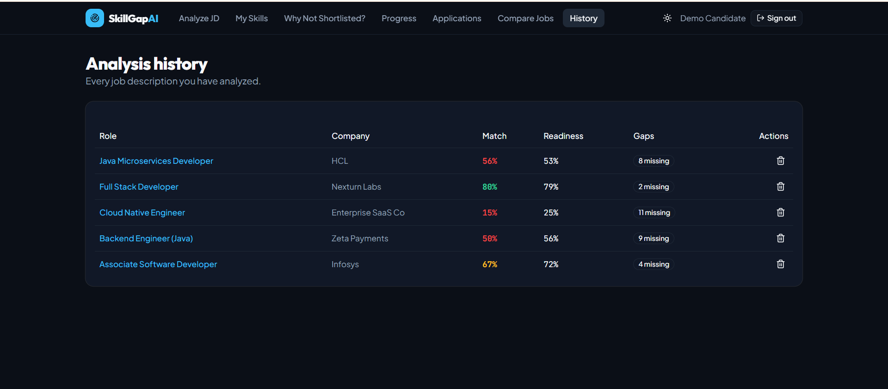

# SkillGap AI — Job Description → Skill Gap, Learning Roadmap & Interview Prep

Paste a job description. SkillGap AI compares it against your resume skills and returns a match
score, exactly which skills are missing, what to learn first (in dependency order, with estimated
days and free tutorials), which interview questions to prepare with model-answer pointers, and a
printable recruiter scorecard.

## 🚀 Project Overview

SkillGap AI is a full-stack career development platform that helps job seekers understand how well their skills match a job description and what they should learn next.

The application allows users to:

- Analyze job descriptions against their current skills
- Identify missing and adjacent skills
- Generate a prioritized learning roadmap
- Prepare for role-specific interview questions
- Track job applications and outcomes
- Compare multiple job opportunities
- Monitor skill and career readiness progress

The project uses a deterministic rule-based engine for skill extraction, matching, scoring, and roadmap generation.

Everything is computed by a **deterministic rule engine — no AI API, no keys, no latency, no bill.**

## Features

| Feature | What it does |
|---|---|
| Skill profile | Paste resume text **or upload a PDF** — skills are extracted server-side and editable as category pills |
| JD analysis | Weighted match score, ✓ strong / ⚠️ adjacent / ❌ missing skills, sub-scores (technical, tooling, experience, project, keyword coverage) |
| Learning roadmap | Gaps ordered by dependency + category weight, each with HIGH/MEDIUM/LOW priority, estimated days, dependency chain, **2 curated free tutorials**, and an "I have learned X" tick-box that recomputes every saved analysis |
| Interview vault | Basic / Intermediate / Project-based / JD-specific questions, each with expandable answer pointers |
| Recruiter view | Printable scorecard with sub-scores, top strengths, top gaps, readiness bar and a verdict stamp (Export PDF via browser print) |
| Why not shortlisted? | Skill demand frequency across every analyzed job (e.g. "Docker requested in 6/6"), biggest recurring blocker, and unlock recommendation |
| Job-to-job comparison | Two roles side by side with a ✓/❌ skill matrix and a best-match verdict |
| Application tracker | Status (Applied / Interviewing / Rejected / Offer), applied date and notes per job, plus an outcome insight correlating rejections with match score |
| Readiness timeline | Weekly chart of your average match score and skills added, with a headline delta |

## Stack

- **Backend** — FastAPI (Python 3.11), Pydantic v2, motor (async MongoDB), pypdf, PyJWT + passlib
- **Frontend** — Vite, React 19, TypeScript (strict), Tailwind CSS v4, shadcn/ui, TanStack Query, recharts
- **Auth** — email/password with a JWT in an httpOnly cookie
- **Engine** — `backend/lib/`: `skills.py` (90+ skill dictionary with aliases, categories, learning days,
  dependencies, adjacency), `engine.py` (extraction + weighted scoring + roadmap), `questions.py`
  (question bank + hints), `resources.py` (curated free learning links)

## Run it locally

Requirements: Python 3.11+, Node 20+, MongoDB running locally.

```bash
# 1. Backend
cd backend
python -m venv .venv && source .venv/bin/activate      # Windows: .venv\Scripts\activate
pip install -r requirements.txt
cp .env.example .env        # or edit .env: MONGO_URL, DB_NAME, CORS_ORIGINS, JWT_SECRET
python seed.py              # optional: demo candidate + 5 analyzed jobs + timeline history
uvicorn server:app --reload --port 8001

# 2. Frontend (second terminal)
cd frontend
yarn install
yarn dev                    # http://localhost:3000  (proxies /api → :8001)
```

Demo login after seeding: **demo@skillgap.ai / demo1234**

## Environment (`backend/.env`)

```
MONGO_URL="mongodb://localhost:27017"
DB_NAME="app"
CORS_ORIGINS="*"
JWT_SECRET="change-me"
```

## API

All routes are mounted under `/api`.

```
POST   /api/auth/signup | /api/auth/login | /api/auth/logout
GET    /api/auth/me                PUT /api/auth/me
GET    /api/skills                 POST /api/resume/parse | /api/resume/upload (multipart)
POST   /api/skills/learn           # roadmap tick-box → recompute all analyses
POST   /api/analyses               GET /api/analyses | /api/analyses/{id}   DELETE /api/analyses/{id}
PATCH  /api/analyses/{id}/application
GET    /api/insights               POST /api/compare        GET /api/progress
```

## Data model (MongoDB collections)

- `users` — name, email, password_hash, skills[], experience_years, resume_text
- `analyses` — role_title, company, jd_text, all scores, required/strong/partial/missing skills,
  roadmap[], questions[], app_status, applied_date, notes
- `progress` — weekly snapshots: average_match, skills_count, jobs_count, event

## Scoring, briefly

Requirements are extracted with longest-alias-first matching, then weighted by category
(languages 30%, frameworks 25%, databases 15%, cloud/DevOps 15%, architecture 8%, testing 4%,
tooling 3%). An adjacent skill you already know counts as half a match. Readiness =
0.45·match + 0.2·technical + 0.15·experience + 0.1·project + 0.1·keywords, with verdict thresholds
at 80% and 65%.

## Tests

```bash
cd backend && pytest        # API specs against the live server
```

## Notes

- `node_modules/` and Python virtualenvs are intentionally excluded from the archive — restore them
  with `yarn install` and `pip install -r requirements.txt`.
- No third-party AI service is used anywhere; all analysis logic is in `backend/lib/`.


## 📸 Application Screenshots

### 🏠 Home Page


### 🔍 Analyze Job Description


### 📊 Analysis Report


### 🧠 My Skills


### 📈 Readiness Timeline


### 📋 Job History


### ❓ Why Not Shortlisted
