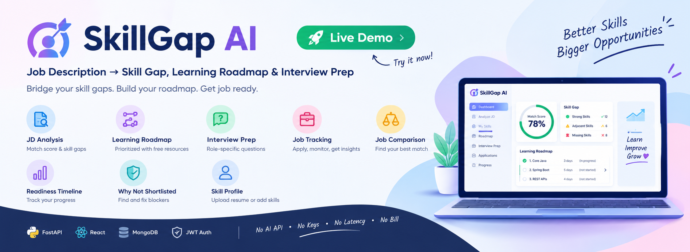
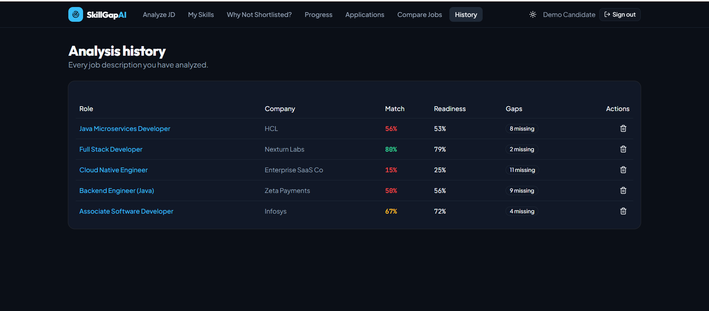

[](https://skillgap-ai-mu.vercel.app/)

<p align="center">
  
</p>

<h1 align="center">SkillGap AI</h1>

<h3 align="center">Job Description Analysis • Skill Gap Detection • Learning Roadmaps • Interview Preparation</h3>

<p align="center">
  <a href="https://skillgap-ai-mu.vercel.app/">
    
  </a>
</p>

<p align="center">
  
  
  
  
  
</p>

---

## 📌 Overview

**SkillGap AI** is a full-stack career development platform that helps job seekers understand how their current skills align with job descriptions and identify what they need to learn next.

Paste a job description, compare it against your resume skills, and get a personalized skill gap analysis, a prioritized learning roadmap, and interview preparation resources.

The platform uses a **deterministic, rule-based engine** for skill extraction, matching, scoring, and roadmap generation. No third-party AI API or API key is required.

## 🌐 Live Application

🚀 **[Launch SkillGap AI](https://skillgap-ai-mu.vercel.app/)**

## ✨ Key Features

| Feature                           | Description                                                                                   |
| --------------------------------- | --------------------------------------------------------------------------------------------- |
| 📄 Resume Skill Extraction        | Paste resume text or upload a PDF to extract and edit your skills.                            |
| 🎯 Job Description Analysis       | Calculate a weighted match score and identify strong, adjacent, and missing skills.           |
| 🗺️ Personalized Learning Roadmap | Get prioritized learning tasks with estimated days, dependencies, and free tutorials.         |
| 🧠 Interview Preparation          | Practice basic, intermediate, project-based, and job-specific questions with answer pointers. |
| 📊 Recruiter Scorecard            | View strengths, skill gaps, readiness metrics, and export a printable scorecard.              |
| 🔍 Shortlisting Insights          | Identify frequently requested skills and recurring gaps across analyzed jobs.                 |
| ⚖️ Job Comparison                 | Compare two job opportunities using a skill matrix and match results.                         |
| 📋 Application Tracker            | Track applications, interview stages, rejections, offers, dates, and notes.                   |
| 📈 Readiness Timeline             | Monitor weekly changes in average match scores, skills, and job analysis activity.            |

## 🛠️ Technology Stack

### Frontend

* React 19
* TypeScript (strict)
* Vite
* Tailwind CSS v4
* shadcn/ui
* TanStack Query
* Recharts

### Backend

* Python 3.11
* FastAPI
* Pydantic v2
* Motor (async MongoDB)
* pypdf
* PyJWT and passlib

### Database & Authentication

* MongoDB
* Email/password authentication
* JWT stored in an HTTP-only cookie

### Skill Analysis Engine

* Rule-based skill extraction and matching
* Weighted scoring and skill categorization
* Dependency-based learning roadmaps
* Interview question bank and curated learning resources

## 🧠 How the Analysis Works

1. Extract skills from resume text or an uploaded PDF.
2. Analyze the job description to identify required skills.
3. Match existing skills against job requirements.
4. Calculate a weighted match score and identify skill gaps.
5. Generate a prioritized learning roadmap with estimated learning days.
6. Recommend interview preparation questions and learning resources.

**Note:** SkillGap AI uses a deterministic rule-based engine rather than a third-party generative AI API.

## 🚀 Getting Started

Follow these steps to run SkillGap AI locally.

### Prerequisites

* Python 3.11+
* Node.js 20+
* MongoDB running locally
* Yarn

### 1. Clone the repository

```bash
git clone https://github.com/Harshitha0501/skillgap-ai.git
cd skillgap-ai
```

### 2. Set up the backend

```bash
cd backend
python -m venv .venv
```

Activate the virtual environment:

**Windows:**

```bash
.venv\Scripts\activate
```

**macOS/Linux:**

```bash
source .venv/bin/activate
```

Install dependencies:

```bash
pip install -r requirements.txt
```

Configure environment variables:

```bash
cp .env.example .env
```

Update `.env` with your MongoDB connection, database name, CORS settings, and JWT secret.

Optionally seed demo data:

```bash
python seed.py
```

Start the backend:

```bash
uvicorn server:app --reload --port 8001
```

### 3. Set up the frontend

Open a second terminal:

```bash
cd frontend
yarn install
yarn dev
```

The frontend runs at:

`http://localhost:3000`

The backend API runs at:

`http://localhost:8001`

### Demo Login

After running the seed script, use the following demo account:

* **Email:** `demo@skillgap.ai`
* **Password:** `demo1234`

## ⚙️ Environment Configuration

Create a `.env` file inside the `backend` directory:

```env
MONGO_URL="mongodb://localhost:27017"
DB_NAME="app"
CORS_ORIGINS="*"
JWT_SECRET="change-me"
```

Use a secure secret and appropriate CORS settings for production deployments.

## 🔌 API Overview

All API routes are mounted under `/api`.

| Method | Endpoint                         | Purpose                   |
| ------ | -------------------------------- | ------------------------- |
| POST   | `/api/auth/signup`               | Register a user           |
| POST   | `/api/auth/login`                | Log in                    |
| POST   | `/api/auth/logout`               | Log out                   |
| GET    | `/api/auth/me`                   | Get current user          |
| PUT    | `/api/auth/me`                   | Update user profile       |
| GET    | `/api/skills`                    | Retrieve skills           |
| POST   | `/api/resume/parse`              | Parse resume text         |
| POST   | `/api/resume/upload`             | Upload and parse a resume |
| POST   | `/api/skills/learn`              | Update learned skills     |
| POST   | `/api/analyses`                  | Create a job analysis     |
| GET    | `/api/analyses`                  | List analyses             |
| GET    | `/api/analyses/{id}`             | Get an analysis           |
| DELETE | `/api/analyses/{id}`             | Delete an analysis        |
| PATCH  | `/api/analyses/{id}/application` | Update application status |
| GET    | `/api/insights`                  | Retrieve insights         |
| POST   | `/api/compare`                   | Compare job opportunities |
| GET    | `/api/progress`                  | Retrieve progress data    |

## 🗄️ Database Structure

The application uses MongoDB collections:

* **users:** User profiles, credentials, skills, experience, and resume text.
* **analyses:** Job descriptions, scores, skill matches, roadmaps, interview questions, and application tracking details.
* **progress:** Weekly snapshots of match scores, skills, job counts, and activity.

## 📊 Scoring Methodology

### Skill Category Weights

| Category       | Weight |
| -------------- | -----: |
| Languages      |    30% |
| Frameworks     |    25% |
| Databases      |    15% |
| Cloud / DevOps |    15% |
| Architecture   |     8% |
| Testing        |     4% |
| Tooling        |     3% |

Adjacent skills count as half a match.

### Readiness Formula

`Readiness = 0.45 × Match + 0.20 × Technical + 0.15 × Experience + 0.10 × Project + 0.10 × Keywords`

Verdict thresholds are 80% and 65%.

## 🧪 Tests

Run the backend tests:

```bash
cd backend
pytest
```

## 📸 Application Screenshots

Explore the main features of SkillGap AI.

### 🏠 Home Page


### 🔍 Analyze Job Description


### 📊 Analysis Report


### 🧠 My Skills


### 📈 Readiness Timeline


### 📋 Job History



### ❓ Why Not Shortlisted?


## 📁 Project Structure

```text
skillgap-ai/
├── backend/
│   ├── lib/
│   │   ├── skills.py
│   │   ├── engine.py
│   │   ├── questions.py
│   │   └── resources.py
│   ├── server.py
│   ├── seed.py
│   └── requirements.txt
├── frontend/
│   ├── src/
│   ├── package.json
│   └── vite.config.ts
├── screenshots/
├── skillgap-ai-banner.png
└── README.md
```

## 👩‍💻 Author

**Harshitha C.**

* GitHub: [Harshitha0501](https://github.com/Harshitha0501)
* Repository: [SkillGap AI](https://github.com/Harshitha0501/skillgap-ai)
* Live Demo: [Launch SkillGap AI](https://skillgap-ai-mu.vercel.app/)

---

<p align="center">
  <b>SkillGap AI — Understand your skill gaps. Build your roadmap. Prepare for your next opportunity.</b>
</p>
